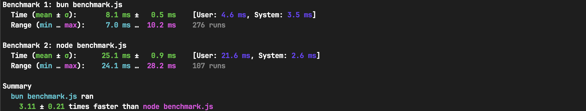

# Bun.js

## Why Bun.js?

Are you tired of Node.js being slow, complex, and outdated? Do you wish there was a better way to run JavaScript and TypeScript code on any machine?

Duno? Nope, lets check out Bun.js, a new and fast JavaScript runtime that offers a simpler and more modern alternative to Node.js.


## What is it?

Bun.js is more than just a runtime. It is also a package manager, a bundler, and a test runner. It is like a Swiss Army knife for JavaScript and TypeScript developers, except it is faster, sharper, and shinier.

This new and fast JavaScript runtime is written in Zig, a low-level programming language that gives you high performance and control over memory management. Instead of V8, the engine used by Node.js and Chrome, Bun.js uses JavaScriptCore, the open source JavaScript engine developed by Apple for Safari. This means that Bun.js starts faster, uses less memory, and runs smoother than Node.js.

Bun.js is not only a runtime and comes with a package manager, a bundler, and a test runner that uses the JavaScriptCore engine and supports both ES modules and CommonJS.

##  What can you do with Bun.js?

Bun.js allows you to create beautiful and dynamic web apps with minimal effort. For example, you can use Bun.js to create a Next.js app, which is a popular framework for building React apps with server-side rendering and static-site generation.

Next.js is compatible with Bun.js, as it can run on Bun.js as the underlying runtime. To create a Next.js app with Bun.js, you just need to install Next.js as a dependency and add a script to your package.json file. Then, you can use the bun command to run the Next.js app in development or production mode.

While Bun seem like a magical tool, it isn’t without issues as is is still in Beta. Might not be suited for big web apps at the moment.
So, that means it may have bugs or it may be missing some features you may need.

Other possible use cases:

- CLI tools
- Scripts
- Small API services

## How stable is Bun.js?

Bun.js is still in beta and not yet production-ready, so you should use it with caution and at your own risk. However, if you are curious and adventurous, you can use Bun.js to experiment with new and exciting possibilities for JavaScript and TypeScript development. You can also use Bun.js to learn more about the internals and workings of JavaScript runtimes, engines, and compilers.

## How does Bun.js compare to other tools?

### Runtime: Node.js

Bun.js is a faster (~3x), simpler, and more modern alternative to Node.js. It uses a different JavaScript engine and language than Node.js, which results in faster start times and reduced memory usage. It also supports both ES modules and CommonJS, as well as some of the latest features and standards of JavaScript and TypeScript.
It avoids some of the common pitfalls and regrets of Node.js, such as callback hell, global scope pollution, and outdated APIs. It also provides a more secure and streamlined development experience, by enforcing strict mode and requiring explicit permissions for potentially sensitive operations.

Benchmark:


benchmark.js:

```javascript
console.log("bun.js fast?!?")
```

### Bundler: Vite

Bun.js has a limited bundler, which is fast but lacks features and options. You may need to use a separate bundler, such as Vite, to get the most out of your JavaScript and TypeScript projects.

As expected Bun.js is compatible with Vite, as Vite can run on Bun.js as the underlying runtime. However, Vite has some features and advantages that Bun.js does not have, such as HMR, Web-standard APIs, and flexible and optimal bundling. Therefore, you should use Vite as a bundler currently, as it provides a better development experience and a more optimal production output than Bun.js.

## Pros and Cons of Bun.js

Bun.js has many benefits, but also some drawbacks. Here are some of the pros and cons of using Bun.js:

### Pros

- Bun.js is fast, starting ~3x faster than Node.js and executing code faster than Node.js in some cases. It is like a runtime on steroids.
- Bun.js is simple, requiring minimal configuration and hassle to use. You can use Bun.js as a single tool that can handle most stuff for JavaScript and TypeScript.
- Bun.js is modern, supporting the latest features and standards of JavaScript and TypeScript, such as ES modules, top-level await, decorators, and optional chaining. It also has a built-in JSX compiler that allows you to write React-like components without any external dependencies!

### Cons

- Bun.js is still in beta and not yet production-ready. It may have bugs, missing features, or breaking changes. You should use it with caution and at your own risk.
- Bun.js is not fully compatible with Node.js or the browser. Some of the Node.js modules and globals are not implemented or work differently in Bun.js. Some of the Web APIs are not compatible with the browser versions or are not implemented at all.
- Bun.js has a limited bundler, which is fast but lacks features and options. Use Vite for now.

## Conclusion

Bun.js is a new and fast JavaScript runtime that offers a simpler and more modern alternative to Node.js. It is an all-in-one toolkit that can handle everything from package management to testing for your JavaScript and TypeScript projects.

Bun.js is still in beta and not yet production-ready, so you should use it with caution and at your own risk. However, if you are curious and adventurous, you can use Bun.js to experiment with new and exciting possibilities for JavaScript and TypeScript development.

I believe that Bun.js has great long-term potential because of the Dev Experience gains you get from the full Bun.js package.

Citation: <https://bunjs.com/>, https://medium.com/deno-the-complete-reference/is-bun-really-much-faster-than-node-js-e5b15942a8e8
