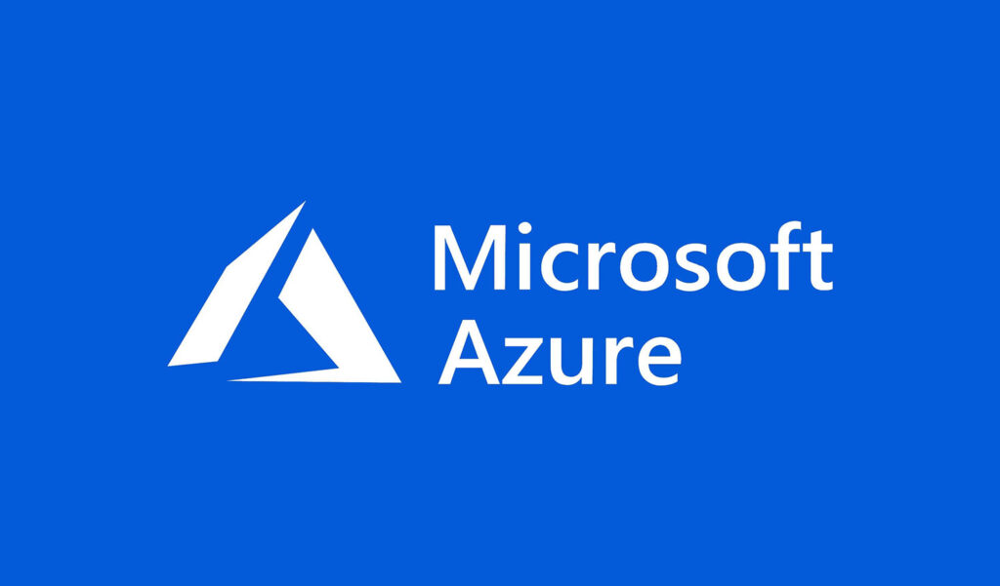
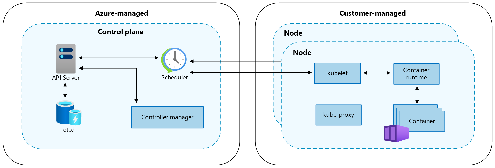

# Azure Kubernetes Service (AKS) - Concepts

## Managed Kubernetes Service

A managed Kubernetes service like AKS is a cloud platform that automates the deployment, scaling, and management of containerized applications using Kubernetes, handling the underlying infrastructure and cluster operations so users can focus on application development and deployment, while reducing complexity and operational overhead compared to a plain Kubernetes setup, which offers more control but requires greater expertise and resources to manage effectively.

## Cluster Components

In an AKS cluster, the two main components are:

1. Control Plane:

   - Manages the Kubernetes cluster's core functions
   - Includes components like the API server, scheduler, and etcd database
   - Handles cluster-wide decisions and orchestration
   - Managed by Microsoft Azure in AKS

2. Nodes:

   - Virtual machines that run containerized applications
   - Host the actual workloads and application pods
   - Communicate with the control plane to receive instructions
   - Managed by the users, but AKS provides tools to simplify node management

Management responsibilities:

- Microsoft Azure manages the control plane, handling updates, monitoring, and ensuring high availability
- Users manage the nodes, including scaling, upgrading (though AKS can assist), and maintaining the node pools

##  Namespaces

AKS namespaces are logical partitions within a Kubernetes cluster that allow you to group and isolate resources.

Namespaces:

- Virtual clusters within a physical cluster
- Provide a scope for names, allowing resources to have the same name in different namespaces
- Enable resource quotas and access controls at the namespace level

Reasons to use namespaces for different environments:

- Cost-effective: Sharing a cluster reduces infrastructure costs compared to separate clusters.
- Resource efficiency: Better utilization of cluster resources across environments.
- Simplified management: Easier to manage a single cluster with multiple namespaces.
- Consistent configuration: Ensures consistency in cluster-wide settings across environments.

Using namespaces for environment separation provides a balance between isolation and resource efficiency, making it a popular choice for many organizations.

##  Networking

Networking is crucial in Kubernetes because it enables communication between pods, services, and external resources, forming the backbone of containerized applications. It is important that topics like the network model is considered early in the Kubernetes cluster planning to ensure the cluster is stable.

Kubernetes networking addresses four key challenges:

1. Container-to-container communication within a pod (solved by localhost)
2. Pod-to-pod communication (the primary networking focus)
3. Pod-to-service communication (handled by Services)
4. External-to-service communication (also managed by Services)

The Kubernetes networking model eliminates the need for explicit port allocation among applications sharing a machine. This approach resolves scaling issues and isolates users from cluster-level networking concerns, simplifying application deployment and communication in containerized environments.

Thanks to the network model, connections between containers are possible through direct addressing without having to set up links first. Each pod also receives its own individual port, which simplifies the coordination of ports across the entire cluster. Network communication within a pod (normally = 1 container) takes place via loopback.

###  CNI

A CNI (Container Network Interface) plugin is used for Kubernetes to assign the IPs and set up the network model. Each cluster must decide on a corresponding CNI.

Azure offers various solutions as CNI plugins:

- Azure CNI for dynamic IP allocation
- Azure CNI overlay
- Azure CNI with cilium

###  Overlay CNI

An Overlay CNI in Kubernetes creates a virtual network layer that enables pod-to-pod communication across nodes and networks, using encapsulation to abstract away underlying network complexities and improve scalability.

Classic CNI vs. Overlay CNI:

- In classic CNI, the cluster is set up in a subnet. The CNI then dynamically uses IPs from this subnet to allocate IPs to pods. This offers full transparency within the subnet, but there's a risk that the subnet may run out of IPs and no new IPs can be allocated. Especially with zero downtime deployments, the cluster temporarily needs multiple times the number of IPs that are actively used. If IPs run out, errors can occur. Therefore, a large subnet (larger than a Class C network) is recommended for classic CNI.

- With Overlay CNI, IP allocation changes. Instead of directly using IPs from the cluster's subnet, a subnet (/24) is created per node. These overlay networks are virtual and separated by NAT. This way, each node can distribute 250 IPs itself, and the cluster is not dependent on the external subnet.

###  Cluster neworking

Kubernetes cluster networking is a comprehensive system enabling communication between various components. It includes pod, node, and service networks, utilizing CNI plugins for implementation. The system incorporates DNS for service discovery, Ingress for external access management, and Network Policies for security. It handles both internal and external load balancing, manages external communication, and uses **overlay networks** for cross-node pod communication. This model provides a flexible, scalable, and secure framework for efficient operation of complex distributed applications within Kubernetes clusters.

###  Why choosing the right network model matters?

Neglecting network model in Kubernetes cluster planning can lead to several problems:

- Performance bottlenecks: The cluster is deployed with a basic network configuration. As traffic increases, they notice severe latency in database queries. Investigation reveals that database pods are communicating across different nodes, causing network congestion.
- Security vulnerabilities: Without proper network policies, a compromised front-end pod can directly access the database, violating the principle of least privilege.
- Scalability issues: As they add more services, they hit IP address limitations in their chosen subnet, requiring a disruptive network reconfiguration.

This scenario illustrates how neglecting network topology can lead to problems during scaling events.

Scenario: An e-commerce company is deploying a new version of their product catalog service.

1. Initial state:

   - The cluster has a /24 subnet (256 IP addresses)
   - 200 IPs are already in use by existing pods and services
   - The product catalog service currently has 10 pods

2. Deployment process begins:

   - Kubernetes initiates a rolling update
   - New pods are created alongside the old ones

3. IP address exhaustion:

   - As new pods are created, they quickly consume the remaining IP addresses
   - The cluster reaches the limit of 256 IPs

4. Deployment stalls:

   - New pods can't be scheduled due to lack of available IP addresses
   - The deployment hangs, leaving the service in a partially updated state

5. Service disruption:

   - Traffic is split between old and new versions, causing inconsistent behavior
   - Some requests fail as the cluster can't properly load balance

6. Cascading effects:

   - Other services that depend on the product catalog are affected
   - Autoscaling of other services fails due to IP exhaustion

7. Emergency mitigation:

   - Ops team forced to manually terminate pods to free up IPs
   - This causes further service disruptions

8. Long-term consequences:
   - Team can't use standard deployment practices
   - Cluster can't scale to meet demand during peak times
   - Development velocity decreases due to deployment constraints

This scenario demonstrates how a seemingly simple oversight in network planning (insufficient IP address space) can lead to significant operational issues. Proper planning would have included:

- Choosing a larger subnet (e.g., a /16 with 65,536 IPs)
- Implementing IP address management (IPAM) solutions
- Using network overlays to expand available IP space
- Planning for separate subnets for different environments or services

By addressing these network topology considerations early, the company could have avoided deployment failures, service disruptions, and limitations on cluster growth.

Citation: <https://learn.microsoft.com/en-us/azure/aks/core-aks-concepts>
