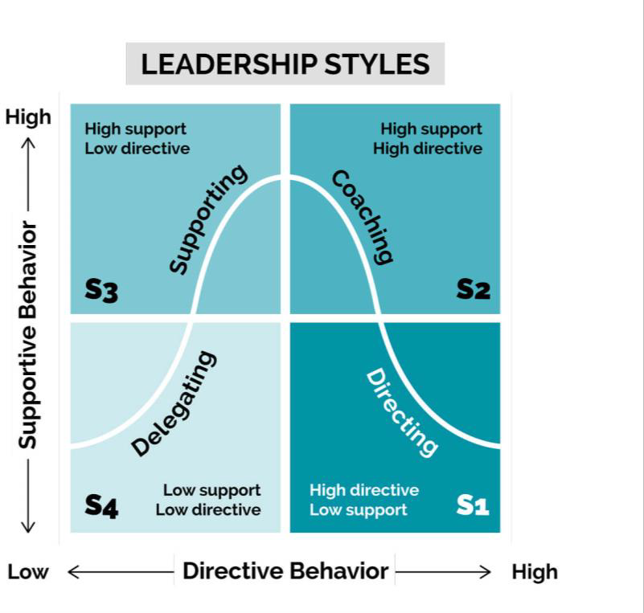

# Delivery Lead

##  What is a Delivery Lead?

A Deliver Lead is a role that is responsible for ensuring the successful delivery of a project. It envolves customer satisfaction, employee satisfaction and day-to-day operations of the project.

Most important activities:

- Steer day-to-day operations
- Ensure customer satisfaction and project team satisfaction
- Support intentional learning on the project
- Drive perfomance management on the project
- Control budget and project milestones

##  Three Pillars of a Delivery Lead

### Project administration

- **Controlling**: bookings, budget and process
- **Infrastructure setup**: Tooling, Data storage & client exchange
- **Invoicing**: review and approval of invoices
- **Information security**: ensure ISO 27001 compliance

### Operational management

- **Delivery management**: ensure deliver accoring to project scope, maintain scope and plan accoring to roadmap, define measures to stay on track
- **Collaboration**: organise internal and client ceremonies, support steering committee
- **Customer satisfaction**: expectation management, stakeholder management
- **Risk and opportunity management**: identify and manage risks, opportunities and threats
- **Project staffing**: trigger staffing process

### People care

- **Leadership**: align project goals & team member goals, identify and resolve team conflicts, maintain team motivation, organize visits and social events, establish continuous improvement, support performance feedback process
- **Intentional learning**: create environment for team and members to grow and develop

##  Situational Leadership

Situational Leadership is a leadership model developed by Paul Hersey and Ken Blanchard. It proposes that there is no single "best" style of leadership, and effective leaders sßhould adapt their approach based on the situation and the readiness level of their followers. The model suggests four leadership styles:

- Directing: High task focus, low relationship focus

- Coaching: High task focus, high relationship focus

- Supporting: Low task focus, high relationship focus

- Delegating: Low task focus, low relationship focus

Leaders should choose the appropriate style based on their assessment of the follower's competence and commitment. As followers develop and become more skilled and motivated, leaders can adjust their style accordingly, moving from more directive approaches to more supportive and delegative ones. This flexibility allows leaders to provide what their team members need most at any given time, enhancing both individual and team performance.

