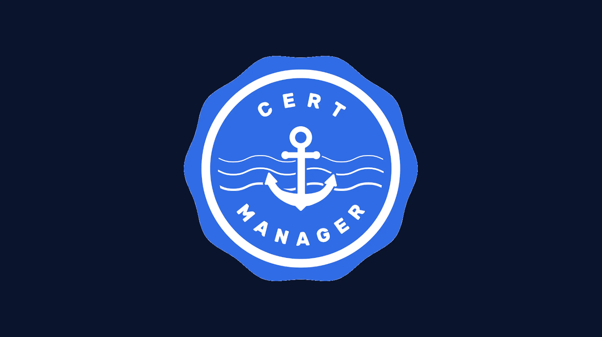

# Cert-Manager



## Table of Contents

- [What is a Cert-Manager?](#what-is-a-cert-manager)
- [Issuers and ClusterIssuers](#issuers-and-clusterissuers)
- [Certificate Issuance Workflow](#certificate-issuance-workflow)
- [Configuration Files](#configuration-files)
  - [ClusterIssuer Configuration](#clusterissuer-configuration)
  - [Cert-Manager Values Configuration](#cert-manager-values-configuration)
  - [Issuer Configuration](#issuer-configuration)
  - [Certificate Configuration](#certificate-configuration)
    - [CA Certificate](#ca-certificate)
    - [Internal Certificate](#internal-certificate)
    - [External Certificate](#external-certificate)
- [Understanding the Setup](#understanding-the-setup)
  - [Why Multiple Issuers?](#why-multiple-issuers)
  - [Internal vs. External Certificates](#internal-vs-external-certificates)
  - [Revisit mTLS (Mutual TLS) for Internal Services](#revisit-mtls-mutual-tls-for-internal-services)
- [Conclusion](#conclusion)

## What is a Cert-Manager?

Cert-manager is a Kubernetes add-on that automates the management and issuance of TLS certificates from various issuing sources, including Let's Encrypt. It simplifies certificate provisioning and renewal for Kubernetes services.

## Issuers and ClusterIssuers

- **Issuer**: A namespaced resource that represents a certificate authority (CA) that cert-manager can use to obtain certificates.
- **ClusterIssuer**: Similar to an Issuer but cluster-scoped, allowing certificates to be issued across all namespaces.

## Certificate Issuance Workflow

1. **Deploy cert-manager**: Install cert-manager into the Kubernetes cluster.
2. **Define Issuers**:
   - ClusterIssuer for external certificates from Let's Encrypt.
   - Self-signed Issuer to create a root CA within the cluster.
   - CA Issuer to issue internal certificates signed by the internal CA.
3. **Request Certificates**:
   - Use certificate resources to request certificates from the appropriate issuer.
4. **Certificate Usage**:
   - Certificates are stored in Kubernetes Secrets and used by applications and services for secure communication.

## Configuration Files

### ClusterIssuer Configuration

**File**: `clusterissuer.yaml` (cluster-wide)

```yaml
apiVersion: cert-manager.io/v1
kind: ClusterIssuer
metadata:
  name: letsencrypt
spec:
  acme:
    server: https://acme-v02.api.letsencrypt.org/directory
    email: root@example.com
    privateKeySecretRef:
      name: letsencrypt
    solvers:
      - http01:
          ingress:
            ingressClassName: nginx
```

**Explanation**:

- ClusterIssuer letsencrypt: Configured to obtain certificates from Let’s Encrypt.
- ACME Protocol: Uses HTTP-01 challenge with NGINX ingress controller to verify domain ownership.

### Cert-Manager Values Configuration

File: `values-cert-manager.yaml` (cluster-wide)

```yaml
ingressShim:
  defaultIssuerKind: ClusterIssuer
  defaultIssuerName: letsencrypt
```

**Explanation**:

- Ingress shim: Automates certificate creation for Ingress resources.
- Default issuer: Sets letsencrypt as the default ClusterIssuer for certificates.

### Issuer Configuration

**File**: `issuer.yaml` (cluster-wide)

```yaml
apiVersion: cert-manager.io/v1
kind: Issuer
metadata:
  name: selfsigned
spec:
  selfSigned: {}
----
apiVersion: cert-manager.io/v1
kind: Issuer
metadata:
  name: ca
spec:
  ca:
    secretName: ca
```

**Explanation**:

- Issuer selfsigned: Used to create a self-signed root CA certificate within the cluster.
- Issuer ca: Uses the root CA certificate (stored in Secret ca) to sign internal certificates.

### Certificate Configuration

### CA Certificate

**File**: `ca.yaml` (namespace-wide)

```yaml
apiVersion: cert-manager.io/v1
kind: Certificate
metadata:
  name: ca
spec:
  commonName: DEV Root CA
  duration: 87600h0m0s # 10 years
  isCA: true
  privateKey:
    algorithm: ECDSA
    size: 256
  secretName: ca
  issuerRef:
    name: selfsigned
```

**Explanation**:

- Certificate ca: Creates a self-signed root CA certificate.
- Issuer reference: Uses the selfsigned Issuer to self-sign the certificate.
- Purpose: Establishes an internal CA for issuing internal certificates.

#### Internal Certificate

**File**: `internal-certificate.yaml` (namespace-wide)

```yaml
apiVersion: cert-manager.io/v1
kind: Certificate
metadata:
  name: database
spec:
  secretName: database-ssl
  dnsNames:
    - "localhost"
    - "127.0.0.1"
    - "*.dev"
  usages:
    - digital signature
    - key encipherment
    - server auth
    - client auth
  issuerRef:
    name: ca
```

**Explanation**:

- Certificate database: Requests an internal certificate for services.
- DNS names: Covers internal service domains.
- Issuer reference: Uses the ca issuer (internal CA) to sign the certificate.
- Purpose: Enables secure communication between internal services.

#### External Certificate

**File**: `external-certificate.yaml` (namespace-wide)

```yaml
apiVersion: cert-manager.io/v1
kind: Certificate
metadata:
  name: platfrom
spec:
  secretName: platfrom-ingress-cert
  dnsNames:
    - api.dev.scp.platformplane.io
    - portal.dev.platformplane.io
    - auth.dev.scp.platformplane.io
  usages:
    - digital signature
    - key encipherment
  issuerRef:
    kind: ClusterIssuer
    name: letsencrypt
```

**Explanation**:

- Certificate platfrom: Requests certificates for external domains.
- DNS names: Lists the external domains to secure.
- Issuer reference: Uses the ClusterIssuer letsencrypt to obtain certificates from Let’s Encrypt.
- Purpose: Secures external endpoints with publicly trusted certificates.

## Understanding the Setup

### Why Multiple Issuers?

- **ClusterIssuer letsencrypt**:
  - Scope: Cluster-wide.
  - Purpose: Obtain publicly trusted certificates for external services.
- **Issuer selfsigned and Issuer ca**:
  - Scope: Namespace-scoped.
  - Purpose: Create an internal CA and issue certificates for internal services.
- **Reasoning**:
  - Separation of Concerns: Different issuers for internal and external certificates enhance security and manageability.
  - Scope Control: Namespace-scoped issuers prevent unauthorized use across namespaces.

### Internal vs. External Certificates

- **Internal Certificates**:
  - Issued By: Internal CA (Issuer ca).
  - Usage: Secure communication between internal services.
  - Certificates: Not publicly trusted; trust is established within the cluster.
- **External Certificates**:
  - Issued By: Let’s Encrypt (ClusterIssuer letsencrypt).
  - Usage: Secure external endpoints accessible over the internet.
  - Certificates: Publicly trusted by clients and browsers.

### Revisit mTLS (Mutual TLS) for Internal Services

- **What is mTLS?**:
  - [Jun: Exploring Linkerd](../06%20June/exploring-linkerd.md)
- **mTLS in Cluster**:
  - Certificates with client auth and server auth Usages:
    - The internal-certificate.yaml certificate includes both server auth and client auth in its usages.
    - The ca.yaml and internal-certificate.yaml establish an internal PKI (Public Key Infrastructure) within your cluster.
    - This enables services to act as both clients and servers in mTLS communication.
- **Purpose**:
  - Secure Internal Communication:
    - mTLS ensures that only authenticated services can communicate within the cluster.
    - Protects against unauthorized access and man-in-the-middle attacks.
- **Implementation**:
  - Certificates Issued by Internal CA:
    - Internal certificates are used for mTLS between services.
    - Services trust the internal CA and validate certificates presented by peers.
- **Benefits**:
  - Enhanced Security:
    - Full control over certificate issuance.
    - Ensures that all parties in communication are verified.
  - Trust Management:
    - Centralized trust with the internal CA simplifies certificate management.
    - No dependence on external services for internal communication.

## Conclusion

A cert-manager automates TLS certificate issuance and renewal in our Kubernetes cluster. Using both ClusterIssuer and namespace-scoped Issuers provides flexibility and enhances security, while mTLS is implemented for internal services using certificates issued by the internal CA, and certificates are stored in Kubernetes Secrets and should be appropriately secured.

Citations:

- <https://cert-manager.io/docs/>
- <https://letsencrypt.org/docs/acme-protocol/>
- <https://kubernetes.io/docs/concepts/services-networking/ingress//>
- <https://kubernetes.io/docs/concepts/configuration/secret/>
